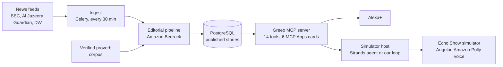

# Greeo

Greeo is an Alexa+ add-on that retells the news as short spoken tales, in the spirit of
African oral storytelling, woven with real, cited proverbs. After a tale, a listener can
ask for the truth behind it: the closing thought, what the proverb means, the facts, the
background, other perspectives and the sources. Greeo remembers what they saved and
where they stopped.

It is built for the Amazon Developer Hackathon, Alexa+ track: a self-hosted MCP server
(MCP spec 2025-11-25 over Streamable HTTP, with MCP Apps cards) and a simulated Echo Show
that hosts it, since the Alexa+ developer preview was not available to us.

## What a listener can do

- **Hear the news as tales:** "What's happening today?", "Tell me about Kenya", then
  "continue". Tales come in short beats, in a light, balanced or serious telling.
- **Ask for the truth behind a tale, in any order:** "what's the lesson?", "what does
  that proverb mean?", "the facts", "why does it matter?", "what do others say?", "who
  reported this?". Then "continue" picks the tale up again.
- **Come back later:** "save this", "what was I listening to?". Needs a linked account.
- **Hear how Greeo was built:** "the behind-the-scenes stories" tells our own friction
  log as tales.
- **Ask "what can you do?"** for a summary that starts from where they are.

## How it works



- **Stories are prepared ahead of time.** Twice an hour, the pipeline reads new
  articles (respecting robots.txt), establishes the facts, context and perspectives,
  chooses proverbs by meaning, and writes each telling. Every telling is checked by
  rules and by an editor model, revised at most once, and published only if it
  passes. No model runs while someone is listening.
- **Proverbs are never written by a model.** The writer places a marker such as
  `{{P1}}`; code inserts the proverb's exact text from the corpus, with its culture
  and source.
- **The MCP server only reads published data,** so every tool answers in milliseconds.
  Every reply is plain text written to be spoken, at most 75 words, with no technical
  words, and each tool links to an MCP Apps card for screens.
- **The simulator plays the part of Alexa+:** a host chooses the tools (a Strands
  Agents agent, our own model loop, or a keyword router), and an Angular Echo Show
  screen shows Greeo's cards and speaks with Amazon Polly.

More detail: [AWS services](docs/AWS_SERVICES.md),
[front-end API](docs/FRONTEND_API.md), [news sources](docs/NEWS_SOURCES.md),
[style guide](docs/GRIOT_STYLE_GUIDE.md), [proverb corpus](docs/proverbs/CORPUS_GUIDE.md),
[friction log](docs/FRICTION_LOG.md), and the phase-by-phase
[walkthroughs](docs/walkthroughs/).

## Run it from a clean clone

You need Docker with Compose, and Node.js 24 for the screen. AWS is optional: without
it Greeo runs on a deterministic mock and synthetic stories.

### 1. Start the backend

```sh
make up        # copies .env.example to .env on first run, then builds and starts
make migrate
curl http://localhost:8000/healthz
```

This starts six services: `web` (Django, admin and the simulator API on :8000), `mcp`
(the MCP server on 127.0.0.1:8001), `worker` and `beat` (Celery), `postgres` and
`redis`.

### 2. Open the Echo Show simulator

```sh
cd frontend
npm ci
npm start      # http://localhost:4200, with /api proxied to :8000
```

### 3a. Try it without AWS

```sh
make seed      # visibly synthetic stories (needs ALLOW_SYNTHETIC=true, the default)
make talk      # a scripted conversation through the real MCP server
```

The mock backend makes no network requests. Its host is a keyword router, and the
screen uses the browser's own speech.

### 3b. Real news with Amazon Bedrock

Put AWS credentials in `.env`, then set:

```sh
LLM_BACKEND=bedrock
AWS_REGION=eu-north-1                    # any region with these models enabled
BEDROCK_MODEL_ID=eu.amazon.nova-lite-v1:0  # default model; the simulator host uses it
LLM_WRITE_TELLING_MODEL_ID=moonshotai.kimi-k2.5
LLM_ESTABLISH_FACTS_MODEL_ID=qwen.qwen3-235b-a22b-2507-v1:0
LLM_RERANK_PROVERB_MODEL_ID=qwen.qwen3-235b-a22b-2507-v1:0
LLM_CHECK_TELLING_MODEL_ID=qwen.qwen3-235b-a22b-2507-v1:0
SIMULATOR_HOST=strands                   # or llm (our own loop)
ALLOW_SYNTHETIC=false
```

Then load the sources and proverbs, and make stories:

```sh
docker compose up -d --force-recreate
docker compose exec web python manage.py load_sources ../data/sources.yaml
docker compose exec web python manage.py import_proverbs ../data/proverbs/demo/africanproverbs_demo.jsonl
docker compose exec web python manage.py trust_proverbs
docker compose exec web python manage.py ingest_now
docker compose exec web python manage.py run_pipeline --limit 3
docker compose exec web python manage.py tell_friction_log
```

After that, `beat` ingests every 30 minutes and runs the pipeline at :10 and :40.
`add_missing_layers` gives older stories their context and perspectives.

The demo proverb corpus has a single source per proverb. Serving it needs
`DEMO_ALLOW_SINGLE_SOURCE_PROVERBS=true`, which is disclosed in
[DEMO_CORPUS.md](docs/proverbs/DEMO_CORPUS.md).

### 3c. Greeo's voice with Amazon Polly (optional)

```sh
SPEECH_BACKEND=polly
POLLY_REGION=us-east-1   # neural voices are not offered in every region
POLLY_VOICE_ID=Ayanda
POLLY_ENGINE=neural
```

The IAM user needs `polly:SynthesizeSpeech`. Each sentence is cached for a day.

### 4. Connect an MCP client directly

The MCP server is at `http://127.0.0.1:8001/mcp`.

```sh
make smoke     # initialize, list the tools, call a few
docker compose exec web python manage.py create_demo_user judge-1   # a bearer token
```

Story tools work for guests. Memory tools (save, saved stories, preferences) need a
bearer token, as account linking would provide on Alexa+.

## Tests and checks

```sh
make test      # backend: pytest
make lint      # backend: ruff
cd frontend && npm test -- --watch=false
```

The backend tests never reach AWS, whatever `.env` says: they force the mock backend,
the mock speech and the scripted host.

## Configuration

Every setting is an environment variable, documented in [.env.example](.env.example).
The ones that change behaviour most:

| Setting | What it does |
| --- | --- |
| `LLM_BACKEND` | `mock` (default, no network) or `bedrock` |
| `LLM_<PROMPT>_MODEL_ID` | The Bedrock model for one prompt, for example `LLM_WRITE_TELLING_MODEL_ID` |
| `LLM_DAILY_TOKEN_BUDGET` | A hard daily cap on model tokens; every call is audited |
| `SIMULATOR_HOST` | Who chooses the tools: `strands`, `llm` or `mock` |
| `SPEECH_BACKEND` | `mock` (browser speech) or `polly` |
| `ALLOW_SYNTHETIC` | Show the synthetic test stories |
| `DEMO_ALLOW_SINGLE_SOURCE_PROVERBS` | Serve the single-source demo corpus |

## Project history

Greeo's concept began as a web prototype for the
[Gemini 3 Hackathon](https://devpost.com/software/greeo): paste a news link, get it
retold as a story with proverbs. This repository is a clean rebuild for Alexa+, started
during the Amazon Developer Hackathon submission period. No prototype code is reused.

What is new in this build:

- A self-hosted MCP server with 14 tools and six MCP Apps cards, and a simulated Echo
  Show that hosts it, designed for voice first: tales in short beats, with the truth
  behind them one question away.
- Stories prepared ahead of time from terms-reviewed news feeds, so no model runs while
  someone is listening.
- Proverbs never written by a model: code inserts each one from a cited corpus.
- Every telling checked against its facts by rules and by an editor model, and revised
  at most once before publication.
- Per-listener memory: what you heard, saved, and where you stopped.
- Amazon Bedrock (Kimi K2.5, Qwen3, Nova), a Strands Agents host and Amazon Polly
  replace Gemini.

## News sources

Greeo retells stories from BBC News, Al Jazeera, The Guardian and DW, credited by name
in every story. See [docs/NEWS_SOURCES.md](docs/NEWS_SOURCES.md) for the full list and
how their content is used.

## License

[MIT](LICENSE)
