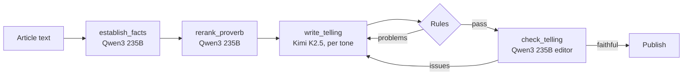

# AWS services

Greeo uses AWS in three places: an editorial pipeline on Amazon Bedrock that turns news
into checked tales, a Strands Agents agent that plays Alexa+ in the simulator, and Amazon
Polly for Greeo's voice. Every model call, whatever makes it, goes through one budgeted,
audited gateway.

| Service | What Greeo uses it for | Code |
| --- | --- | --- |
| Amazon Bedrock Runtime (Converse API) | Five editorial prompts, each with the model that suits it (below) | `backend/apps/llm/backends.py` (`BedrockLLM`), `backend/apps/llm/client.py` (`LLMGateway`) |
| Strands Agents SDK, on Bedrock | The simulator's agent host: chooses which of Greeo's MCP tools to call | `backend/apps/simulator/strands_host.py` (`StrandsHost`) |
| Amazon Polly (neural) | Greeo's spoken voice in the simulator, paced per storyteller | `backend/apps/simulator/speech.py` (`PollySpeech`) |
| Amazon RDS for PostgreSQL (deployment option) | Stories, evidence metadata, listener memory, model-call audit | `backend/config/settings/base.py` |
| Amazon ElastiCache for Redis (deployment option) | Token budget, session context, speech cache | `backend/apps/llm/budget.py`, `backend/apps/simulator/state.py` |

## Amazon Bedrock: a multi-model editorial pipeline

Twice an hour (`backend/apps/stories/pipeline.py`), each new article goes through:



| Prompt | Model | Why this model |
| --- | --- | --- |
| `establish_facts` | `qwen.qwen3-235b-a22b-2507-v1:0` | Accurate and cheap at facts, context and perspectives, keeping names and numbers exact |
| `rerank_proverb` | `qwen.qwen3-235b-a22b-2507-v1:0` | Chooses proverbs by meaning from the whole corpus |
| `write_telling` | `moonshotai.kimi-k2.5` | Told the best tales in side-by-side trials on live BBC stories |
| `check_telling` | `qwen.qwen3-235b-a22b-2507-v1:0` | The editor: flags invented names, numbers, causes or exaggeration that changes the facts |
| `simulator_host` | `eu.amazon.nova-lite-v1:0` | Fast tool choice for the conversation, through our loop or Strands |

- **One revision, bounded.** A telling that fails the rules or the editor is rewritten
  once with the exact problems; if it still fails, it is not published.
- **Models never write proverbs.** The writer places markers such as `{{P1}}`; code
  inserts the corpus text.
- **Per-prompt choice.** `LLM_<PROMPT>_MODEL_ID`, `_TEMPERATURE` and `_MAX_TOKENS` set
  each prompt's model independently, so a model can be swapped without code changes.
- **Budgeted and audited.** Every call reserves tokens against `LLM_DAILY_TOKEN_BUDGET`
  before it runs (Redis), settles with the provider's reported usage, and writes an
  `LLMCall` record: prompt and version, model, tokens, latency, cost estimate, outcome.
  Prompt contents and generated text are never stored.

Anthropic models on Bedrock were tried first and failed with an AWS Marketplace
permission error; see the [friction log](FRICTION_LOG.md).

## Strands Agents: the agent that plays Alexa+

Alexa+ chooses an add-on's tools itself. In the simulator, a Strands `Agent` does that
job (`SIMULATOR_HOST=strands`):

- **Tools come from MCP.** Each of the 14 tools in Greeo's `tools/list` becomes a Strands
  tool, called over MCP through the simulator's `ContextLink`, so the conversation's story
  is filled in and a listener never skips a beat.
- **The model chooses, Greeo speaks.** The words a listener hears are the tool's checked
  `spoken` text, never the model's paraphrase. If the agent answers without a tool, its
  own words are allowed only as brief small talk; anything about the news is replaced by
  a real search.
- **Bounded.** Tools run one at a time, at most `SIMULATOR_MAX_TOOL_ITERATIONS` per turn;
  a tool stops the agent loop when a beat is repeated or the cap is reached.
- **Inside the same gateway.** Strands calls Bedrock itself (`BedrockModel`), but each
  run reserves budget first and is audited as backend `strands` with Strands' own token
  counts.

The same contract is implemented by `LLMHost` (our own Converse loop) and a keyword
router, so the three can be compared; traces and the screen label which one chose.

## Amazon Polly: Greeo's voice

`SPEECH_BACKEND=polly` makes the simulator's `/tts` endpoint speak each sentence with
Polly's neural engine, paced per storyteller with SSML rate and pauses
(`backend/apps/stories/voices.py`), and cached for a day in Redis. Polly runs in its own
region (`POLLY_REGION=us-east-1`) because neural voices are not offered in eu-north-1,
where Bedrock runs. On a real Alexa+ device, Alexa does its own speech.

## Turning it on

AWS is opt-in: a clean clone runs on a deterministic mock with no network requests.

```sh
LLM_BACKEND=bedrock
AWS_REGION=eu-north-1
BEDROCK_MODEL_ID=eu.amazon.nova-lite-v1:0
LLM_WRITE_TELLING_MODEL_ID=moonshotai.kimi-k2.5
LLM_ESTABLISH_FACTS_MODEL_ID=qwen.qwen3-235b-a22b-2507-v1:0
LLM_RERANK_PROVERB_MODEL_ID=qwen.qwen3-235b-a22b-2507-v1:0
LLM_CHECK_TELLING_MODEL_ID=qwen.qwen3-235b-a22b-2507-v1:0
SIMULATOR_HOST=strands
SPEECH_BACKEND=polly
POLLY_REGION=us-east-1
```

IAM permissions used: `bedrock:InvokeModel` and `bedrock:InvokeModelWithResponseStream`
for the models above, and `polly:SynthesizeSpeech` (plus `polly:DescribeVoices` to list
voices).
