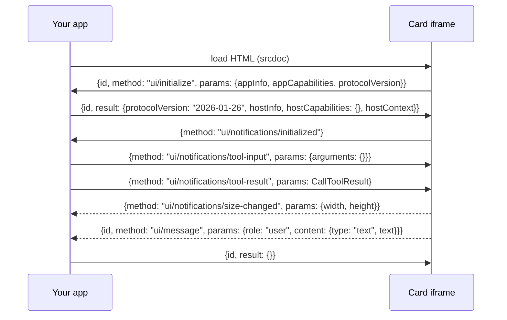

# Front-end API contract (simulator)

Everything the Greeo simulator front end needs, without reading the backend. Examples
are real responses from the running stack with the synthetic event loaded
(`make up && make migrate && make seed`).

The front end is the **device and the MCP Apps host**: it listens, speaks, shows cards
and passes taps back as speech. The backend decides which Greeo tools to call.

## Basics

| | |
| --- | --- |
| Base URL | `http://127.0.0.1:8000/api/simulator` (the `web` service) |
| Format | JSON in and out, except `/tts`, which returns audio |
| CORS | Origins from `CORS_ALLOWED_ORIGINS` (default `http://localhost:4200`, `http://localhost:5173`). Allowed request headers: `Accept`, `Authorization`, `Content-Type`, `X-Greeo-User` |
| Angular tip | Use a dev proxy (`proxy.conf.json` mapping `/api` to `http://127.0.0.1:8000`) and CORS never comes up |

### Who is listening

Send **one** of these on every request:

| Header | When | Notes |
| --- | --- | --- |
| `Authorization: Bearer greeo_…` | Demo and judging | Token from `docker compose exec web python manage.py create_demo_user <name>`, shown once. |
| `X-Greeo-User: <any-name>` | Local development only | Honoured only when the backend runs with `DJANGO_DEBUG=true` (the default locally). |
| nothing | Guest | Every story works; saving, saved stories and preferences reply that an account is needed. |

### Sessions

`session_id` is one conversation: short-term context such as "the story we're on",
kept 30 minutes. It must match `^[A-Za-z0-9_-]{1,64}$`; `crypto.randomUUID()` fits.
Make a new one per visit or after "start over". The **listener's** memory (progress,
saves, tone) lives on the server and survives new sessions.

## Endpoints

### `POST /turn`: one thing the listener said

Request:

```json
{ "session_id": "c1", "text": "tell me about the footbridge" }
```

`text` is 1–500 characters: speech-to-text output, typed input, or a chip's label.

Response `200`, always for any conversational outcome, including "I couldn't find that":

```json
{
  "spoken": "Listen. In Veloria, the Pell River ran wide and cold, and the children crossed it by canoe to reach school. The elders say Test proverb one is spoken here.",
  "display": {
    "tool": "tell_tale",
    "resource_uri": "ui://greeo/tale",
    "structured": {
      "spoken": "Listen. In Veloria, …",
      "next_options": ["continue", "the facts"],
      "story_id": "st_c07675295ace",
      "title": "SYNTHETIC EVENT: The Lantern Footbridge of Veloria",
      "progress": {
        "current": "tale",
        "steps": [
          { "key": "tale", "label": "TALE", "state": "current" },
          { "key": "closing", "label": "REFLECTION", "state": "ahead" },
          { "key": "proverbs", "label": "PROVERBS", "state": "ahead" },
          { "key": "facts", "label": "FACTS", "state": "ahead" },
          { "key": "context", "label": "CONTEXT", "state": "ahead" },
          { "key": "perspectives", "label": "PERSPECTIVES", "state": "ahead" },
          { "key": "sources", "label": "SOURCES", "state": "ahead" }
        ]
      },
      "beat": 1,
      "beats_total": 3,
      "has_more": true,
      "tone_served": "balanced",
      "voice_style": "moonlight_elder",
      "voice_name": "Moonlight Elder",
      "text": "Listen. In Veloria, …",
      "proverbs_used": [
        { "slot": "P1", "culture": "Synthetic culture", "spoken_form": "Test proverb one is spoken here." }
      ]
    },
    "is_error": false
  },
  "tool_trace": [
    { "tool": "search_events", "args": { "query": "the footbridge" }, "ms": 259, "ok": true },
    { "tool": "tell_tale", "args": { "story_id": "st_c07675295ace", "beat": 1 }, "ms": 64, "ok": true }
  ],
  "host_mode": "mock"
}
```

| Field | Meaning | What the UI does |
| --- | --- | --- |
| `spoken` | Exactly what to say. Never empty. At most 75 words. | Speak it (see `/tts`) and show it in the conversation. Do not rewrite it. |
| `display` | The last tool's result. `{}` when no tool ran (help text, sign-in problems). | See below. |
| `display.tool` | Which Greeo tool produced it. | Pick a card or a native view. |
| `display.resource_uri` | The card for this result, or `null`. Always `null` when `is_error` is true. | If set, load and show that card. |
| `display.structured` | The tool's data. Shapes below. | Pass to the card; use `next_options` for chips. |
| `display.is_error` | The tool answered with a friendly problem. | Show `spoken` calmly; no card. |
| `tool_trace` | Every MCP tool call this turn, in order, with time and outcome. | Show it in the developer panel. |
| `host_mode` | `"mock"` (keyword router) or `"llm"` (a model chose the tools). | Show it in the developer panel; label it honestly. |

When `resource_uri` is `null` but the result succeeded (for example `get_briefing`,
`search_events`, `save_for_later`, `get_saved_stories`, `set_preferences`), render a
simple native view: a list of story titles, a "Saved" toast, and so on. On Alexa+ this is
"hydrated" display: the device draws the data itself.

A no-match example (`display.is_error` true, `200` status):

```json
{
  "spoken": "I couldn't find a story about volcanoes. You could hear today's stories, or try another topic.",
  "display": {
    "tool": "search_events",
    "resource_uri": null,
    "structured": {
      "error": "no_results",
      "spoken": "I couldn't find a story about volcanoes. …",
      "next_options": ["today's stories"]
    },
    "is_error": true
  },
  "tool_trace": [{ "tool": "search_events", "args": { "query": "volcanoes" }, "ms": 22, "ok": false }],
  "host_mode": "mock"
}
```

Response `400` for invalid input only (field-by-field, not speakable):

```json
{ "session_id": ["This value does not match the required pattern."], "text": ["This field is required."] }
```

### `POST /reset`: start over

```json
{ "session_id": "c1" }
```

Response `200`: `{ "reset": true }`. Clears the session and the listener's short-term
context. Saves and progress are kept. Saying "start over" through `/turn` does the same.

### `GET /resource?uri=ui://greeo/<card>`: fetch a card's HTML

Response `200`:

```json
{ "uri": "ui://greeo/tale", "mime_type": "text/html;profile=mcp-app", "text": "<!doctype html>…" }
```

`400` for any URI not starting with `ui://greeo/`; `404` if the card does not exist. The
six cards are `tale`, `wisdom`, `facts`, `context`, `perspectives` and `sources`. Their
HTML changes only on redeploy, so cache it per URI for the page's lifetime.

### `POST /tts`: audio for one sentence

```json
{ "text": "Listen.", "voice": "moonlight_elder" }
```

`text` is one sentence, at most 600 characters. `voice` is optional; send
`display.structured.voice_style` when speaking a tale beat, so pacing matches the
storyteller.

| Status | Body | UI does |
| --- | --- | --- |
| `200` | `audio/mpeg` bytes; header `X-Greeo-Speech-Cache: hit` or `miss` | Play it. |
| `204` | empty | Speech is not configured (the default). Use the browser's `speechSynthesis`. |
| `400` | field errors | Split the text into sentences first. |

Split `spoken` on sentence ends (`. ! ?` followed by a space), request each sentence,
and play them in order. Request the next sentence while the current one plays.

## Structured data by tool

TypeScript shapes for `display.structured`. Every successful result also has `spoken`
and `next_options: string[]` (at most five).

```ts
interface Envelope { spoken: string; next_options: string[] }

interface LayerStep { key: 'tale' | 'closing' | 'proverbs' | 'facts' | 'context' | 'perspectives' | 'sources';
                      label: string; state: 'current' | 'heard' | 'ahead' }
interface StoryEnvelope extends Envelope {
  story_id: string; title: string; progress: { current: string; steps: LayerStep[] };
}
interface SourceRef { publisher: string; date: string }
interface ProverbDetail {
  slot: string; spoken_form: string; original_text: string; language: string;
  culture: string; meaning: string; source_citation: string;
  verification_status: 'verified' | 'single_source';
}

// search_events, get_briefing  (no card)
interface StoryList extends Envelope {
  stories: { story_id: string; title: string; region: string }[]; page: number; has_more: boolean;
}
// tell_tale  -> ui://greeo/tale
interface TaleBeat extends StoryEnvelope {
  beat: number; beats_total: number; has_more: boolean;
  tone_served: 'light' | 'balanced' | 'serious'; voice_style: string; voice_name: string;
  text: string;                                   // the beat exactly as written
  proverbs_used: { slot: string; culture: string; spoken_form: string }[];
}
// get_moral  -> ui://greeo/wisdom
interface ClosingThought extends StoryEnvelope {
  closing_kind: 'moral' | 'reflection' | 'none'; text: string; proverb_note: string;
  proverbs: ProverbDetail[];
}
// explain_proverb  -> ui://greeo/wisdom
interface ProverbExplanation extends StoryEnvelope {
  proverbs: ProverbDetail[]; has_proverb: boolean; which: number; proverbs_total: number;
  spoken_form: string; original_text: string; language: string; culture: string;
  meaning: string; source_citation: string; verification_status: string;
}
// get_facts  -> ui://greeo/facts
interface FactList extends StoryEnvelope { facts: { text: string; sources: SourceRef[] }[] }
// get_context  -> ui://greeo/context
interface ContextList extends StoryEnvelope {
  context: { kind: 'background' | 'why_it_matters' | 'consequence'; label: string; text: string; sources: SourceRef[] }[];
}
// get_perspectives  -> ui://greeo/perspectives
interface PerspectiveList extends StoryEnvelope { perspectives: { label: string; summary: string; sources: SourceRef[] }[] }
// get_sources  -> ui://greeo/sources
interface SourceList extends StoryEnvelope {
  sources: { publisher: string; headline: string; date: string;
             supports: ('facts' | 'context' | 'perspectives')[]; url: string | null }[];
}
// save_for_later  (no card)
interface SaveResult extends Envelope { story_id: string; title: string; saved: boolean }
// get_saved_stories  (no card)
interface SavedList extends Envelope {
  stories: { story_id: string; title: string; saved: boolean; tone: string; last_beat: number;
             beats_total: number; tale_completed: boolean; resume_hint: string }[];
}
// set_preferences  (no card)
interface PreferencesResult extends Envelope { tone: string | null; regions: string[]; topics: string[]; reset: boolean }

// Any tool, when display.is_error is true
interface FriendlyError { error: string; spoken: string; next_options: string[] }
```

`error` values you may see: `no_results`, `no_more_results`, `unknown_story`,
`which_story`, `beat_out_of_range`, `tale_unavailable`, `proverb_out_of_range`,
`proverb_unavailable`, `needs_account`, `nothing_to_change`, `unknown_topic`,
`invalid_request`, `unexpected`. Treat them all the same way: speak `spoken`, offer
`next_options`. Only `needs_account` deserves special UI (a "sign in" hint).

## Showing a card (you are the MCP Apps host)

Cards are self-contained HTML that talk to the host with JSON-RPC over `postMessage`,
per the MCP Apps specification. `backend/apps/mcp_server/ui/dev.html` is a working
reference host in about 60 lines.

**Frame.** Put the card's HTML in an iframe with `sandbox="allow-scripts"` (no
`allow-same-origin`) using `srcdoc`. In Angular, pass it through
`DomSanitizer.bypassSecurityTrustHtml` for the `srcdoc` binding; this is safe because the
iframe is sandboxed. Accept messages only where `event.source === iframe.contentWindow`.

**Sequence for each result that has a card:**



All messages carry `"jsonrpc": "2.0"`. Answer every request (a message with both `id`
and `method`) with the same `id`.

**The host context** you return from `ui/initialize`:

```json
{
  "theme": "dark",
  "displayMode": "inline",
  "availableDisplayModes": ["inline"],
  "containerDimensions": { "width": 1280, "maxHeight": 800 },
  "locale": "en-GB",
  "platform": "web"
}
```

`theme` is `"dark"` or `"light"`. Cards pick a small, medium or large layout from the
width (under 600, 600–999, 1000 and over). Send
`{method: "ui/notifications/host-context-changed", params: {theme: "light"}}` to change
theme without reloading.

**The tool result** you send as `ui/notifications/tool-result` is built from the turn
response:

```ts
const params = {
  content: [{ type: 'text', text: turn.spoken }],
  structuredContent: turn.display.structured,
  isError: turn.display.is_error,
};
```

**Messages from the card:**

| Method | Meaning | Do |
| --- | --- | --- |
| `ui/notifications/size-changed` | The card's content size | Set the iframe height (up to your limit). |
| `ui/message` | A suggestion chip was tapped | Reply `{id, result: {}}`, then send `params.content.text` to `POST /turn` as if spoken. |
| anything else | Not used by Greeo's cards | Reply with a JSON-RPC error or ignore. |

**Replacing a card.** Before removing an iframe, send
`{id, method: "ui/resource-teardown", params: {reason: "next turn"}}` and wait briefly
for the reply; the card disables its chips, matching Alexa's rule that nothing stays
tappable after the session moves on.

## Putting a turn together

```text
listener speaks  -> SpeechRecognition -> text
POST /turn {session_id, text}
  -> add "you said" and "Greeo said" to the conversation
  -> developer panel: tool_trace, host_mode
  -> if display.resource_uri: GET /resource (cached) -> iframe -> handshake -> tool-result
     else if display.structured has stories: native list
  -> chips: display.structured.next_options (also inside the card)
  -> speak: split spoken into sentences -> POST /tts each -> play, or speechSynthesis on 204
  -> voice-only mode: skip all display, keep speaking
```

A tale is told one beat per turn. When `has_more` is true, "continue" (spoken, typed or
tapped) gets the next beat. Do not auto-advance unless you want a "keep playing" mode.

## Status and failure cases

| Situation | What you get | UI does |
| --- | --- | --- |
| Normal answer | `200`, `display.is_error: false` | Speak, show card. |
| Tool had a problem (no match, unknown story) | `200`, `display.is_error: true` | Speak `spoken`, show chips, no card. |
| Token revoked or unknown | `200`, `spoken`: "That sign-in is no longer valid…", `display: {}` | Prompt to sign in again. |
| Too many requests | `200`, `spoken`: "That's a lot at once…", `display: {}` | Back off briefly. |
| Greeo (MCP) unreachable | `200`, `spoken`: "I can't reach Greeo right now…", `display: {}` | Show a retry. |
| Model failed (`llm` mode) | `200`, `spoken`: "I'm having trouble with that just now…", `display: {}` | Speak it; nothing special. |
| Nothing matched in `mock` mode | `200`, `spoken`: "I didn't catch that…", `display: {}` | Speak it; offer "today's stories". |
| Bad input | `400` with field errors | A bug in the app; do not speak it. |
| Web service down | network error | Show an offline state. |

All spoken text is already safe to read aloud: no URLs, identifiers or technical words.

## Honesty labels for the demo

- Show that this is a simulator, for example "Greeo simulator — stand-in for an Alexa+ device".
- Show `host_mode`: `mock` means a keyword router chose the tools, not a model.
- The simulator speaks tale text word for word. Real Alexa+ composes its own reply from the tool data and may reword it; the card shows the exact text.
- Do not use Amazon logos, product images or the Echo light-ring design.
